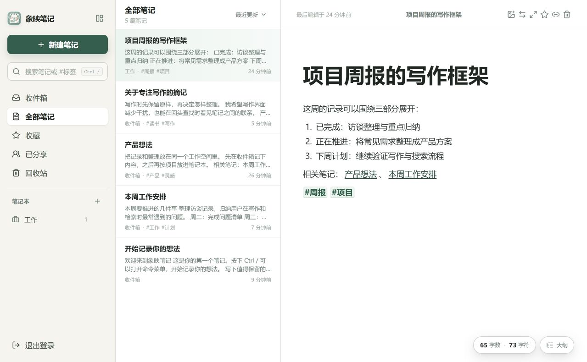
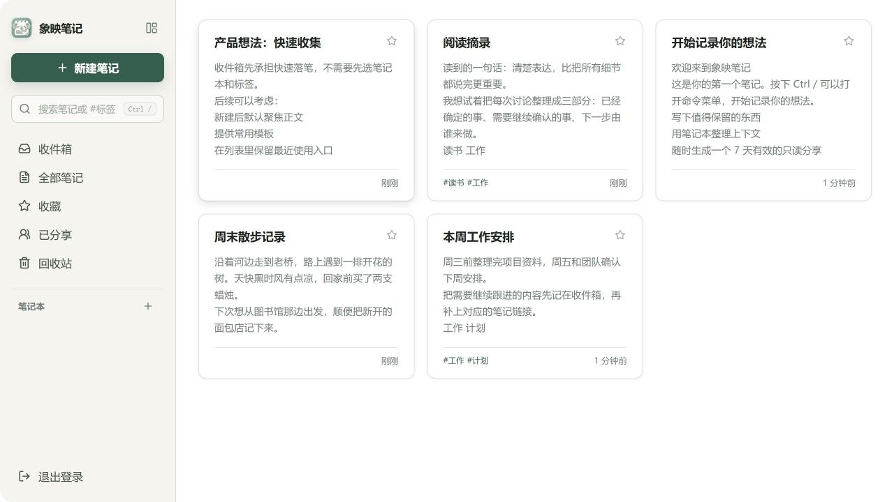
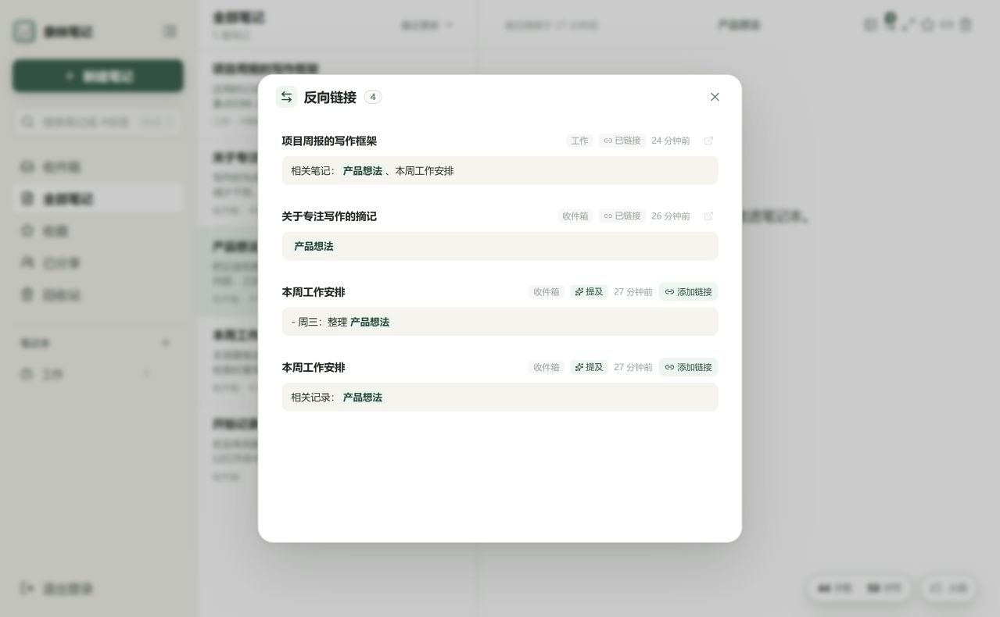
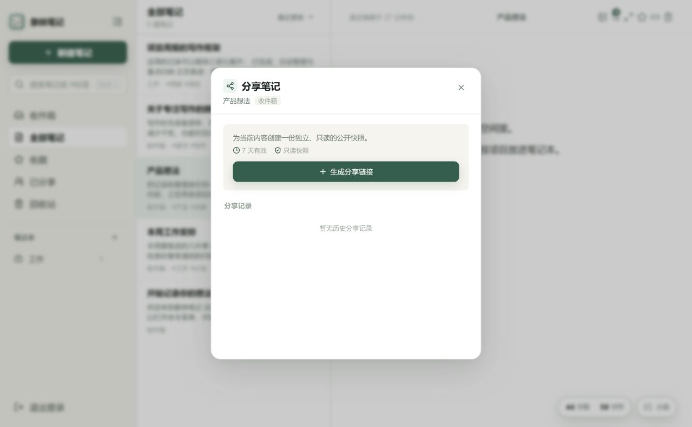

# 象映笔记

> 给想法一个安静的落脚处，记下来，也慢慢理清它们之间的关系。

象映笔记是一款面向个人的 Markdown 笔记应用。它把写作、待办清单、图片、笔记整理、全文搜索和笔记关联放在同一个工作区。你可以先把内容写进收件箱，等有空时再归类、加标签，或连到相关笔记。

你可以在自己的电脑、家用服务器或 NAS 上运行象映笔记。笔记正文保存在你部署的服务所使用的 SQLite 数据库中，图片附件保存在单独的目录里；不需要把笔记交给第三方云笔记服务托管。

## 看看实际界面

以下截图来自象映笔记的浅色模式，笔记标题和正文均为虚构演示数据。

**三栏工作区：** 左侧切换收件箱和笔记本，中间浏览笔记，右侧直接编辑内容。



**卡片视图：** 多篇笔记并排显示，浏览时可以一起看到标题、摘要、标签和更新时间。



**反向链接：** 查看哪些笔记引用了当前内容，也能发现还没有建立链接的同名提及。



**只读分享：** 分享窗口会说明链接有效期；本截图没有生成真实分享链接。



## 象映笔记能帮你做什么

- **随手记录：** 在收件箱里先记下灵感、会议内容、阅读摘录、计划和待办，不必一开始就决定放在哪里。
- **慢慢整理：** 用笔记本、标签和收藏建立适合自己的分类；误删的内容可以先从回收站恢复。
- **方便找回：** 搜索标题和正文，用双向链接把相关笔记连起来，再通过反向链接看到它们之间的关系。
- **按需分享：** 生成一条 7 天有效的只读链接，可以提前撤销；也可以把笔记和图片打包导出。
- **自己保管：** 自行部署服务、管理数据目录，并按自己的习惯备份。

## 写作时，少一点打断

编辑器支持标题、粗体、斜体、删除线、列表、任务清单、引用、代码块、链接和分隔线。它保留 Markdown 的结构，也可以直接像普通文档一样编辑。

新建或修改的内容会自动保存，保存状态会在编辑器里显示。正文下方可以查看字数和字符数。中文输入法组合文字也经过处理，减少输入过程中格式快捷键误触的情况。

需要插入图片时，可以使用编辑器的上传按钮，也可以粘贴或拖入图片。支持 JPEG、PNG、WebP 和 GIF；插入后可以拖动图片边角调整显示宽度。笔记导出时，图片附件也会一并打包。

如果要专心写一会儿，可以打开沉浸模式或打字机模式；编辑区的大纲会列出正文里的 H1–H3 标题，点选标题即可跳到对应位置。

## 整理方式由你决定

象映笔记提供收件箱、全部笔记、收藏、已分享和回收站几个常用入口。收件箱适合暂存新内容；笔记本可以按项目、主题、工作或生活建立，图标和颜色也可以自选。

在正文里写上 `#工作`、`#读书` 这样的标签，象映笔记会为它们建立索引。之后可以点标签筛选笔记，也可以在搜索框或命令菜单中输入 `#标签名` 查找。

笔记列表可以按最近更新、创建时间或标题排序，也可以切换为卡片网格。收藏适合放常用或近期关注的笔记；回收站里的内容可以恢复，确认不再需要后再永久删除。

## 搜索，也能把笔记连起来

全局搜索会查找笔记标题和正文，适合找一段记不清标题的记录。要在当前笔记里查找，可以从命令菜单选择“在当前笔记中查找”，再输入关键词并确认；也可以在命令框中输入 `搜索 关键词`。匹配内容会在正文中标出，按 `F3` 或 `Shift + F3` 可以移动到下一个或上一个位置。

在正文中输入 `[[`，可以从已有笔记中选择要关联的内容，也可以直接新建一篇相关笔记。例如：

```text
[[2026 年度计划]]
[[2026 年度计划|今年的计划]]
```

笔记底部的反向链接会列出引用当前笔记的内容。象映笔记也会提示正文中尚未建立链接的同名提及，方便你按需补上关联。重命名目标笔记时，已有双向链接会同步更新。

## 在电脑、平板和手机上使用

界面会根据屏幕宽度调整，适合在电脑、平板和手机的浏览器中使用。浏览器支持安装时，可以把象映笔记添加到主屏幕，像应用一样打开。外观可以设为浅色、深色，或跟随系统。

在多个设备上登录同一个账号时，笔记和笔记本的变化会通知其他已打开的页面并刷新列表。正文同时在多台设备上编辑时，内容不会自动合并，建议同一时间只在一台设备上编辑同一篇笔记。

## 分享和带走自己的内容

分享笔记时，象映笔记会生成一条 7 天有效的只读链接。链接每次打开都会读取笔记当前内容，因此后续修改也会公开显示；笔记移入回收站时链接无法读取，恢复后可继续使用。你可以在“已分享”或笔记的分享窗口中查看记录并撤销链接。请记住，任何拿到有效链接的人都能阅读其中的内容。

导出会把当前未删除的笔记打包为 ZIP：笔记以 Markdown 文件保存，并按笔记本归类；图片附件也包含在压缩包里。这样可以留作备份，也方便以后用其他 Markdown 工具打开。

如果你会使用 iPhone 或 Mac 的快捷指令，还可以配置导入 API，把一段 Markdown 直接送进收件箱。该功能需要在部署时设置 `XIANGYING_API_TOKEN`，详细方式见下方“快捷指令导入”。

## 使用前请了解

- 象映笔记目前供一个人使用，不提供公开注册、多人协作或多租户账号。
- 使用时需要连接到运行象映笔记的服务；目前不支持断网编辑和稍后自动上传。
- 多设备通知用于更新其他页面的笔记列表和内容，不会合并同时发生的正文编辑。
- 分享链接是公开只读链接。链接有效期为 7 天，也可以提前撤销。
- 建议定期备份数据库和图片附件目录。服务运行期间不要直接复制正在使用的 SQLite 数据库文件；请先停服，或使用 SQLite 在线备份方式。

## 快速开始

最简单的长期使用方式是用 Docker 在自己的服务器或 NAS 上运行。先在项目目录创建 `.env`：

```dotenv
XIANGYING_USERNAME=xiangying
XIANGYING_PASSWORD=请换成仅你自己知道的长密码
# 使用快捷指令导入时再设置：
# XIANGYING_API_TOKEN=请填写随机生成的令牌
# 使用远程 MCP 时另行设置，不要与上面的导入令牌共用：
# XIANGYING_MCP_TOKEN=请用 openssl rand -hex 32 生成
```

创建持久化数据卷并启动：

```bash
docker volume create xiangying-notes-data

docker run -d \
  --name xiangying-notes \
  --restart unless-stopped \
  -p 3000:3000 \
  --env-file .env \
  -v xiangying-notes-data:/data \
  ghcr.io/biaobiaobiao108/xiangying-notes:latest
```

启动后打开 `http://127.0.0.1:3000/app` 并使用 `.env` 中的账号登录。数据库和图片附件都会保存在 `xiangying-notes-data` 数据卷中，更新容器时继续使用同一个数据卷即可。

如果通过 HTTPS 反向代理从公网访问，请把 `PUBLIC_URL` 设置为实际访问的 HTTPS 根地址，并根据代理情况启用 `TRUST_PROXY=true` 和 `COOKIE_SECURE=true`。仅在本机或局域网使用 HTTP 时，`COOKIE_SECURE` 保持默认的 `false`。

### Agent 接入（MCP）

MCP 服务直接运行在象映笔记容器内，不需要另起一个服务。生成独立的访问令牌并写入容器环境：

```bash
openssl rand -hex 32
```

```dotenv
XIANGYING_MCP_TOKEN=上一步生成的随机令牌
PUBLIC_URL=https://notes.example.com
```

在 MCP 客户端中填写服务地址 `https://notes.example.com/mcp`，认证方式选择自定义 HTTP Bearer Token。首版使用静态令牌，不提供 OAuth 自动授权；客户端需要支持发送 `Authorization: Bearer <令牌>` 请求头。令牌拥有整个笔记库的搜索、读取、创建和更新权限，请只配置给可信客户端。修改令牌后需要重新创建容器，令牌不会因单纯重启容器而从 `.env` 重新读取。

反向代理需要将 `/mcp` 转发到应用容器，保留 `Authorization`、MCP 协议请求头和 POST 请求体，并允许 `text/event-stream` 响应及时传递。使用 Nginx 时应为该路径关闭响应缓冲（例如设置 `proxy_buffering off`）；其他代理使用对应的流式响应设置。不要把令牌放入 URL 查询参数。MCP 提供的工具包括：列出和创建笔记本、搜索与分页、读取笔记、创建笔记，以及携带版本号更新笔记。发生版本冲突时，工具会返回当前笔记供 agent 合并后重试。

MCP 只传输文字和 Markdown，不提供图片内容或缩略图。正文中的图片引用会原样保留，方便后续编辑时保留这些引用；MCP 令牌不能用于读取 `/api/assets/` 下的图片。工具结果只通过 MCP 文本 `content` 返回一次 JSON，不另附重复的结构化结果。

### 本机运行

在安装了 Bun 的电脑上运行：

```bash
bun install
```

将 `.env.example` 复制为 `.env`，填写 `XIANGYING_USERNAME` 和 `XIANGYING_PASSWORD`，然后构建并启动：

```bash
bun run build
bun run start
```

访问 `http://127.0.0.1:3000/app`。修改项目并进行开发时，可以运行 `bun run dev`。

### 快捷指令导入

配置 `XIANGYING_API_TOKEN` 后，将快捷指令中的“获取 URL 内容”设为 `POST`，请求地址使用 `https://你的域名/api/import`，请求头添加：

```text
Authorization: Bearer 你的令牌
Content-Type: text/markdown
```

请求正文放入要保存的 Markdown 文本。每次导入都会在收件箱新建一篇笔记。请通过 HTTPS 调用，并把令牌放在请求头里，不要放进网址。

## 常用快捷键

| 快捷键 | 操作 |
| --- | --- |
| `Ctrl + /` 或 `Ctrl + K` | 打开命令菜单 |
| `Ctrl + F` | 打开命令菜单；有较短的选中文字时将其带入搜索框 |
| `Ctrl + \` | 收起或展开侧栏 |
| `Alt + V` | 在三栏列表和卡片网格之间切换 |
| `Ctrl + Shift + F` | 进入或退出沉浸模式 |
| `Alt + Shift + T` | 开启或关闭打字机模式 |
| `F3` / `Shift + F3` | 查看当前笔记中的下一个 / 上一个查找结果 |
| `Esc` | 关闭当前浮层，或按顺序退出当前模式 |

macOS 上把 `Ctrl` 换成 `⌘`，把 `Alt` 换成 `⌥`。

## 项目信息

象映笔记使用 Bun、TypeScript、React、Bun Server 和 SQLite 构建。开发时运行 `bun run dev`，类型检查、测试和构建命令分别是 `bun run typecheck`、`bun test` 和 `bun run build`。

当前仓库未声明独立开源许可证。若要公开分发或二次开发，请先确认项目的授权范围。
