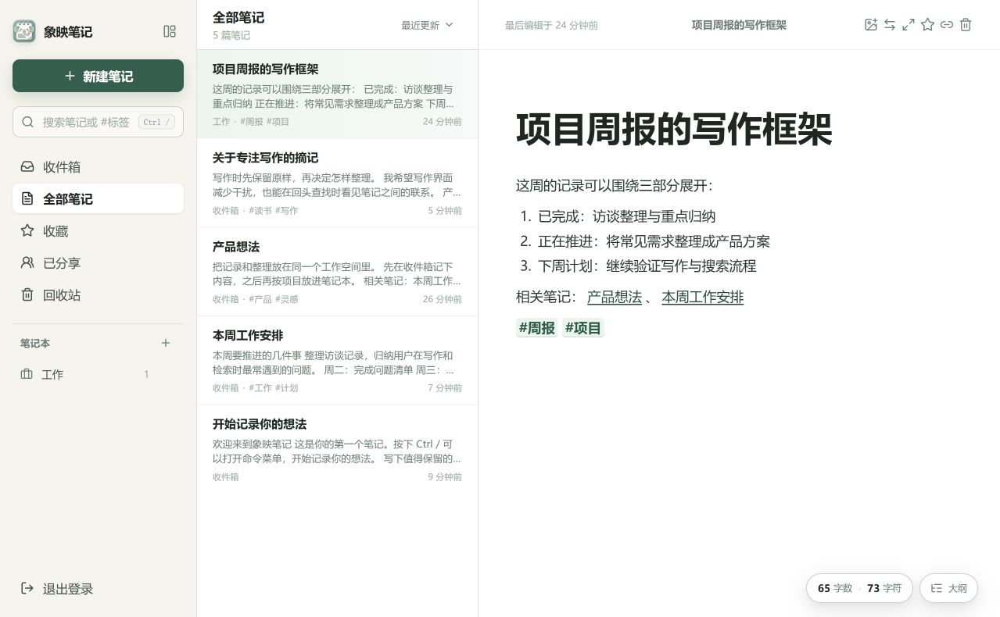
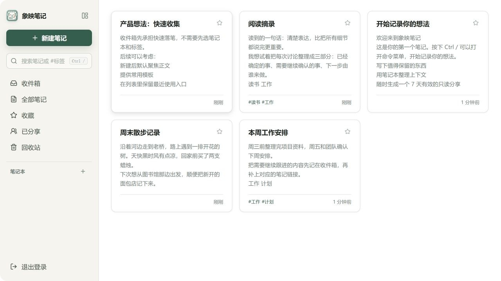
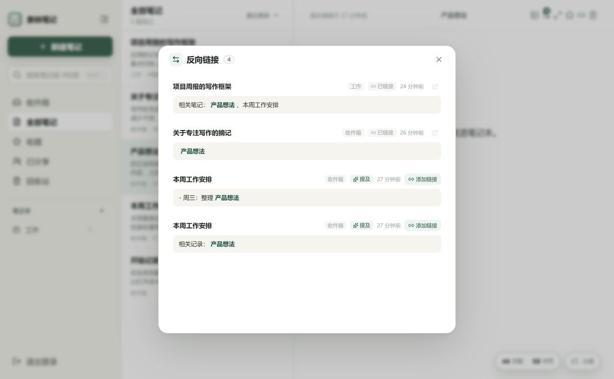

# 象映笔记

> 给想法一个安静的落脚处，记下来，也慢慢理清它们之间的关系。

象映笔记是一款面向个人的 Markdown 笔记应用。它把写作、待办清单、图片、笔记整理、全文搜索和笔记关联放在同一个工作区。你可以先把内容写进收件箱，等有空时再归类、加标签，或连到相关笔记。

你可以在自己的电脑、家用服务器或 NAS 上运行象映笔记。笔记正文保存在你部署的服务所使用的 SQLite 数据库中，图片附件保存在单独的目录里；不需要把笔记交给第三方云笔记服务托管。

## 看看实际界面

以下截图来自象映笔记的浅色模式，笔记标题和正文均为虚构演示数据。

**三栏工作区：** 左侧切换收件箱和笔记本，中间浏览笔记，右侧直接编辑内容。



**卡片视图：** 多篇笔记并排显示，浏览时可以一起看到标题、摘要、标签和更新时间。



**反向链接：** 查看哪些笔记引用了当前内容，也能发现还没有建立链接的同名提及。



## 象映笔记能帮你做什么

- **随手记录：** 在收件箱里先记下灵感、会议内容、阅读摘录、计划和待办，不必一开始就决定放在哪里。
- **慢慢整理：** 用笔记本、标签和收藏建立适合自己的分类；误删的内容可以先从回收站恢复。
- **方便找回：** 搜索标题和正文，用双向链接把相关笔记连起来，再通过反向链接看到它们之间的关系。
- **带走内容：** 把笔记和图片打包导出，保留 Markdown 原文与附件。
- **自己保管：** 自行部署服务、管理数据目录，并按自己的习惯备份。

## 写作时，少一点打断

编辑器支持标题、粗体、斜体、删除线、列表、任务清单、引用、代码块、链接和分隔线。它保留 Markdown 的结构，也可以直接像普通文档一样编辑。

新建或修改的内容会自动保存，保存状态会在编辑器里显示。正文下方可以查看字数和字符数。中文输入法组合文字也经过处理，减少输入过程中格式快捷键误触的情况。

需要插入图片时，可以使用编辑器的上传按钮，也可以粘贴或拖入图片。支持 JPEG、PNG、WebP 和 GIF；插入后可以拖动图片边角调整显示宽度。笔记导出时，图片附件也会一并打包。

Markdown 中引用的外站图片默认不会自动加载。需要查看时，点击图片位置的加载按钮；浏览器随后会向图片所在站点发起请求。

如果要专心写一会儿，可以打开沉浸模式或打字机模式；编辑区的大纲会列出正文里的 H1–H3 标题，点选标题即可跳到对应位置。

## 整理方式由你决定

象映笔记提供收件箱、全部笔记、收藏和回收站几个常用入口。收件箱适合暂存新内容；笔记本可以按项目、主题、工作或生活建立，图标和颜色也可以自选。

在正文里写上 `#工作`、`#读书` 这样的标签，象映笔记会为它们建立索引。之后可以点标签筛选笔记，也可以在搜索框或命令菜单中输入 `#标签名` 查找。

笔记列表可以按最近更新、创建时间或标题排序，也可以切换为卡片网格。收藏适合放常用或近期关注的笔记；回收站里的内容可以恢复，确认不再需要后再永久删除。

## 搜索，也能把笔记连起来

全局搜索会查找笔记标题和正文，适合找一段记不清标题的记录。要在当前笔记里查找，可以从命令菜单选择“在当前笔记中查找”，再输入关键词并确认；也可以在命令框中输入 `搜索 关键词`。匹配内容会在正文中标出，按 `F3` 或 `Shift + F3` 可以移动到下一个或上一个位置。

在正文中输入 `[[`，可以从已有笔记中选择要关联的内容，也可以直接新建一篇相关笔记。例如：

```text
[[2026 年度计划]]
[[2026 年度计划|今年的计划]]
```

笔记底部的反向链接会列出引用当前笔记的内容。象映笔记也会提示正文中尚未建立链接的同名提及，方便你按需补上关联。重命名目标笔记时，已有双向链接会同步更新。

## 在电脑、平板和手机上使用

界面秉持内敛、克制、通透纯净的文人手记设计语言。暖白画布、表面卡片与复古松柏军绿协同呈现，彻底摒弃死灰粗边框与花哨彩色方盒；列表采用呼吸感浮动手记行，正文遵循出版物黄金阅读行高，顶栏与弹窗带有温润的微磨砂通透质感。

界面会根据屏幕宽度自适应调整，适合在电脑、平板和手机的浏览器中使用。浏览器支持安装时，可以把象映笔记添加到主屏幕，像应用一样打开。外观支持浅色、深色，或跟随系统。

在多个设备上登录同一个账号时，笔记和笔记本的变化会通知其他已打开的页面并刷新列表。正文同时在多台设备上编辑时，内容不会自动合并，建议同一时间只在一台设备上编辑同一篇笔记。

## 带走自己的内容


导出会把当前未删除的笔记打包为 ZIP：笔记以 Markdown 文件保存，并按笔记本归类；图片附件也包含在压缩包里。这样可以留作备份，也方便以后用其他 Markdown 工具打开。

如果你会使用 iPhone 或 Mac 的快捷指令，还可以配置导入 API，把一段 Markdown 直接送进收件箱。该功能需要在部署时设置 `XIANGYING_API_TOKEN`，详细方式见下方“快捷指令导入”。

## 使用前请了解

- 象映笔记目前供一个人使用，不提供公开注册、多人协作或多租户账号。
- 使用时需要连接到运行象映笔记的服务；目前不支持断网编辑和稍后自动上传。
- 多设备通知用于更新其他页面的笔记列表和内容，不会合并同时发生的正文编辑。
- 建议定期备份数据库和图片附件目录。服务运行期间不要直接复制正在使用的 SQLite 数据库文件；请先停服，或使用 SQLite 在线备份方式。

## 快速开始

最简单的长期使用方式是用 Docker 在自己的服务器或 NAS 上运行。先在项目目录创建 `.env`：

```dotenv
XIANGYING_USERNAME=
XIANGYING_PASSWORD=
# 使用快捷指令导入时再设置：
# XIANGYING_API_TOKEN=
# 使用远程 MCP 时另行设置，不要与上面的导入令牌共用：
# XIANGYING_MCP_TOKEN=
```

复制为 `.env` 后，必须先为 `XIANGYING_USERNAME` 和 `XIANGYING_PASSWORD` 填入自己的登录凭据。快捷指令导入与远程 MCP 是可选功能；启用时分别生成独立随机令牌并填写对应变量。

创建持久化数据卷并启动：

```bash
docker volume create xiangying-notes-data

docker run -d \
  --name xiangying-notes \
  --restart unless-stopped \
  -p 3000:3000 \
  --env-file .env \
  -v xiangying-notes-data:/data \
  ghcr.io/biaobiaobiao108/xiangyin-notes:latest
```

启动后打开 `http://127.0.0.1:3000/app` 并使用 `.env` 中的账号登录。数据库和图片附件都会保存在 `xiangying-notes-data` 数据卷中。**注意：不要在 `.env` 里设置 `DATABASE_PATH`**——容器内的数据库路径固定为 `/data/xiangying-notes.sqlite`，一旦覆盖，数据和附件会写到容器内部目录而不在数据卷中，重建容器即丢失。首次启动的空数据库会自动初始化；升级已有安装时，拉取新镜像并停止旧容器后，显式执行迁移，再启动新版本：

```bash
docker pull ghcr.io/biaobiaobiao108/xiangyin-notes:latest
docker stop xiangying-notes
docker run --rm --env-file .env -v xiangying-notes-data:/data --entrypoint bun ghcr.io/biaobiaobiao108/xiangyin-notes:latest dist/server/migrate.js
docker rm xiangying-notes
```

迁移完成后，按上面的启动命令重新创建容器，并继续使用原数据卷。即使该版本没有待执行的迁移，迁移命令也可安全重复运行。

如果通过 HTTPS 反向代理从公网访问，请把 `PUBLIC_URL` 设置为实际访问的 HTTPS 根地址，并根据代理情况启用 `TRUST_PROXY=true` 和 `COOKIE_SECURE=true`。启用 `TRUST_PROXY` 时还要通过 `TRUSTED_PROXY_ADDRESSES` 配置应用实际看到的反向代理 IP（逗号分隔）；应用只信任这些代理转发的客户端 IP。反向代理应覆盖 `X-Forwarded-For` / `X-Real-IP`，并阻止公网绕过代理直连应用。仅在本机或局域网使用 HTTP 时，`COOKIE_SECURE` 保持默认的 `false`。

### Agent 接入（MCP）

MCP 服务直接运行在象映笔记容器内，不需要另起一个服务。生成独立的访问令牌并写入容器环境：

```bash
openssl rand -hex 32
```

```dotenv
XIANGYING_MCP_TOKEN=上一步生成的随机令牌
PUBLIC_URL=https://notes.example.com
```

在 MCP 客户端中将服务地址填写为 `https://notes.example.com/mcp/<URL 编码后的令牌>`，无需额外配置 Bearer 请求头；MCP 只接受路径令牌，旧的 `Authorization` 认证方式不再生效。令牌仍从 `XIANGYING_MCP_TOKEN` 环境变量读取，拥有整个笔记库的搜索、读取、创建、更新、笔记本和回收站管理权限，请只配置给可信客户端。令牌位于 URL 路径中，可能出现在代理访问日志；请为 `/mcp/<令牌>` 配置路径脱敏，并只通过 HTTPS 访问。修改令牌后需要重新创建容器，令牌不会因单纯重启容器而从 `.env` 重新读取。

反向代理需要将 `/mcp/<令牌>` 转发到应用容器，保留 MCP 协议请求头和 POST 请求体，并允许 `text/event-stream` 响应及时传递。使用 Nginx 时为该路径关闭响应缓冲（`proxy_buffering off`）；其他代理使用对应流式响应设置。

MCP 推荐工具：

- 笔记本：`list_notebooks`、`ensure_notebook`、`create_notebook`、`update_notebook`、`delete_notebook`。
- 搜索与读取：`search_notes`、`get_note`、`get_notes_batch`、`get_note_outline`、`get_note_section`。
- 写入：`save_note`、`create_note`、`update_note`、`append_to_note`、`replace_in_note`、`insert_into_note`、`replace_note_section`。
- 管理：`manage_note`、`batch_update_notes`。回收站搜索统一用 `search_notes({view:"trash"})`。

按名称操作笔记本无需先查 ID。涉及笔记本的工具同时接受 `notebookId` / `notebookName`，二者同时存在时以 ID 为准；无效 ID 不回退到名称。`ensure_notebook({name})` 获取或创建并返回 `created`，已有笔记本的颜色、图标不被修改。以下调用可一次创建缺失的笔记本并保存文案：

```json
{
  "title": "文案标题",
  "contentMarkdown": "完整 Markdown 正文",
  "notebook": { "notebookName": "文案", "createIfMissing": true },
  "mode": "create"
}
```

`save_note` 的 `mode` 默认是 `create`；`create` 模式省略 `notebook` 时目标为收件箱。在目标笔记本内已有未删除的同标题笔记时，`create` 返回 `NOTE_EXISTS` 和有界候选，不再创建副本；不同笔记本允许同标题。明确需要创建同名笔记时使用 `create_note`。`upsert` 必须指定笔记本，在该笔记本内按精确标题匹配：不存在则创建，唯一则更新，多篇返回 `AMBIGUOUS_NOTE`。更新已有笔记必须传读取时的 `expectedVersion`，否则返回 `VERSION_REQUIRED`。`tags` 追加到提交正文。所有写入工具的版本输入统一为 `expectedVersion`，不接受 `version` 或 `baseVersion`；读取结果仍返回 `note.version`。`update_note` 覆盖 `contentMarkdown` 必须提供 `expectedVersion`。仅改标题和局部编辑可以省略版本，服务端读取最新版本后仍以乐观锁保存。所有冲突的 `error.current` 只返回有界摘要、长度、版本及元数据；需要正文时再读取，旧版本不会静默覆盖新版本。

`get_note` 按 ID 或精确标题读取，不再自动退回子串搜索；`get_note` 与 `save_note` 的标题匹配均忽略 ASCII 大小写，只裁剪查询参数的首尾空白，不裁剪已存储标题。因此仅改变查询标题的大小写或首尾空白不能消歧，仅大小写不同的标题须使用 ID 区分。重复标题返回最多 5 个有界候选，可通过笔记本限定范围；`matchCount` 最多为 6，达到 6 时可能只是实际匹配数的下限，`truncated:true` 表示候选未完整列出。`get_note({includeContent:false})` 只返回元数据和摘要，节省正文传输。模糊查找用 `search_notes`，支持最多 20 个 `tags`、`tagMode=all|any`、`notebookName` 和 `sort=relevance|updated_desc|created_desc`，单标签也使用 `tags:["标签"]`。默认有查询时按相关性排序，无查询时按更新时间排序；返回命中字段 `match.field`，正文命中提供有界 `snippet`。支持视图与游标分页。每页默认 20 篇，摘要默认 120 个 Unicode 字符，不返回正文或缩略图。

长笔记可先用 `get_note_outline` 获取 `headings` 和 `version`，再用 `get_note_section` 按 `sectionId` 或精确 `heading` 读取；同名标题返回 `AMBIGUOUS_SECTION`，以从 1 开始的 `occurrence` 消歧。只识别 Markdown 文档级 ATX/setext 标题，不把代码、引用、列表或 HTML 内标题当成章节。章节包括标题和其下子章节，直到下一同级或更高级标题；`replace_note_section` 的 `contentMarkdown` 替换整个章节，必须包含希望保留的标题和子章节。建议将读取时的版本作为 `expectedVersion` 提交。正文改变后旧 `sectionId` 失效，需重新读取大纲；可传空正文删除章节。其余正文保持原样。

写操作默认不返回正文，通过 `includeContent=true` 显式请求；管理和批量更新不支持该参数。`get_notes_batch` 最多读取 50 篇，总正文预算默认 20,000、最大 100,000 个 Unicode code points；超预算项列在 `oversizedIds` / `remainingIds`，逐篇读取不构成同一时刻快照。`contentLength` 同样按 code points 统计；单篇正文硬上限为 1,000,000 个 UTF-16 code units。普通笔记优先一次提交，只有客户端无法承载或 MCP 请求体超过 4.5 MB 时才用 `append_to_note` 分段，分段不能突破单篇上限。完整结果仅放在 `structuredContent` 中，`content` 只提供简短摘要，避免重复传输 JSON。客户端必须将 `structuredContent` 传递给模型；不支持仅透传文本的连接链路。省流量通过章节读取、摘要长度、批量预算和 `includeContent` 控制。

成功结果统一为 `{ok:true,...}`。版本冲突、目标不存在、标题或章节歧义等可恢复业务分支返回 `{ok:false,error:{code,message,recoverable:true,...}}`，不设置 MCP `isError`，也不通过抛异常传递；按情况提供 `suggestedAction`、`currentVersion`、有界 `current` 摘要或 `matches`，调用方根据 `error.code` 继续处理。笔记、笔记本或正文片段不存在使用 `NOT_FOUND` 并保留 `target`，章节不存在使用 `SECTION_NOT_FOUND`，不提供旧错误码别名。参数错误由 SDK 校验拒绝，或返回带 `isError:true`、`recoverable:false` 的结构化结果。正文、ID、版本和错误恢复信息均从 `structuredContent` 读取。

`replace_in_note` 支持唯一片段、`occurrence` 或 `replaceAll`；显式 `applyToLatest=true` 会在最新正文中精确查找 `oldText` 后替换，写入仍使用乐观锁，不是强制覆盖。旧参数 `force` 不再接受。`insert_into_note` 支持锚点前后插入、`occurrence` 或 `insertAll`。二者按非重叠匹配计数，歧义时不写入。末尾独立标签行会保留在追加正文之后。

收藏使用目标值而非 toggle。`manage_note` 的 `set_tags` 必须显式传 `mode=replace|add|remove`；批量标签用 `tags` 追加、`removeTags` 移除、`replaceTags` 整体替换，整体替换与其他标签操作互斥。`batch_update_notes` 的 `notes` 每项包含 `noteId` 和读取时的 `expectedVersion`，逐项执行并报告 `updatedCount`、`noopCount`、`failedCount`。`partial` 始终为布尔值：成功（包括无需变更）与失败混合时为 `true`，全部成功或全部失败时为 `false`。根级 `ok` 仅在所有项成功时为 `true`；有失败时为 `false`，调用方必须查看 `results` 逐项判断，避免重试已经成功的项。回收站只读，先恢复再修改；批量恢复仅传 `deleted:false`。

删除笔记本可先传 `dryRun:true`，返回 `wouldDeleteNotebook` 与 `wouldMoveNotes`，不执行删除。正式删除必须 `confirm:true`，建议将 `list_notebooks` 包括回收站的 `totalCount` 作为 `expectedNoteCount`；事务中数量不一致则拒绝。删除会将全部笔记移入收件箱并使其旧版本失效，系统收件箱不能删除。MCP 不提供永久删除笔记或清空回收站。配置有效的 `PUBLIC_URL` 后，笔记结果包含 `webUrl`（`/app?note=<id>`），登录后可直接打开对应笔记。

MCP 只传输文字和 Markdown，不提供图片上传、图片数据或缩略图；正文可引用 HTTPS 图片或当前用户可用于该笔记的已上传附件，无效或不可用的图片引用会被拒绝，令牌不能用于读取 `/api/assets/` 图片。代码区外未转义的 `#标签` 会被索引，每个最多 40 个 UTF-16 code units；字面井号可用反斜杠转义。工具参数必须是 JSON 对象，结构化参数可直接传多行 Markdown；手写 JSON 的控制字符须按 JSON 规范转义。读取结果提供 ISO 时间字段。

### 本机运行

在安装了 Bun 的电脑上运行：

```bash
bun install
```

将 `.env.example` 复制为 `.env`，填写 `XIANGYING_USERNAME` 和 `XIANGYING_PASSWORD`，然后构建并启动：

```bash
bun run build
bun run start
```

访问 `http://127.0.0.1:3000/app`。修改项目并进行开发时，可以运行 `bun run dev`。

升级已有安装时，已有数据库不会在启动时自动迁移，请在停服后显式执行迁移再启动新版本：

```bash
bun run db:migrate
```

### 快捷指令导入

配置 `XIANGYING_API_TOKEN` 后，将快捷指令中的“获取 URL 内容”设为 `POST`，请求地址使用 `https://你的域名/api/import`，请求头添加：

```text
Authorization: Bearer 你的令牌
Content-Type: text/markdown
```

请求正文放入要保存的 Markdown 文本。每次导入都会在收件箱新建一篇笔记。请通过 HTTPS 调用，并把令牌放在请求头里，不要放进网址。

## 常用快捷键

| 快捷键 | 操作 |
| --- | --- |
| `Ctrl + /` 或 `Ctrl + K` | 打开命令菜单 |
| `Ctrl + F` | 打开命令菜单；有较短的选中文字时将其带入搜索框 |
| `Ctrl + \` | 收起或展开侧栏 |
| `Alt + V` | 在三栏列表和卡片网格之间切换 |
| `Ctrl + Shift + F` | 进入或退出沉浸模式 |
| `Alt + Shift + T` | 开启或关闭打字机模式 |
| `F3` / `Shift + F3` | 查看当前笔记中的下一个 / 上一个查找结果 |
| `Esc` | 关闭当前浮层，或按顺序退出当前模式 |

macOS 上把 `Ctrl` 换成 `⌘`，把 `Alt` 换成 `⌥`。

## 项目信息

象映笔记使用 Bun、TypeScript、React、Bun Server 和 SQLite 构建。开发时运行 `bun run dev`，类型检查、测试和构建命令分别是 `bun run typecheck`、`bun test` 和 `bun run build`。

当前仓库未声明独立开源许可证。若要公开分发或二次开发，请先确认项目的授权范围。

### 笔记图片导出

在编辑器顶栏或命令菜单选择“导出图片”，可预览并下载当前标题和正文（包含未保存修改）。采用固定浅色文人笔记排版，720px 排版宽度、2 倍分辨率，短篇单图，长篇按内容分页；多页支持逐页 PNG 或 ZIP 打包。图片导出在本机浏览器完成。外链图片需要允许跨域读取，失败时可重试或选择占位块；超高表格单行需先拆分。单次最多 200 页，ZIP 最大 128 MiB。
